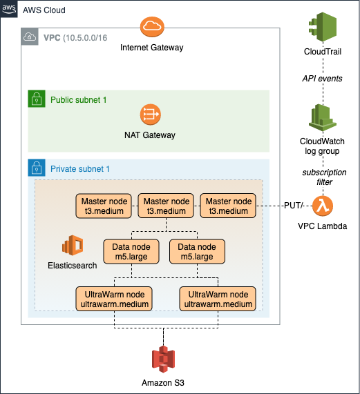
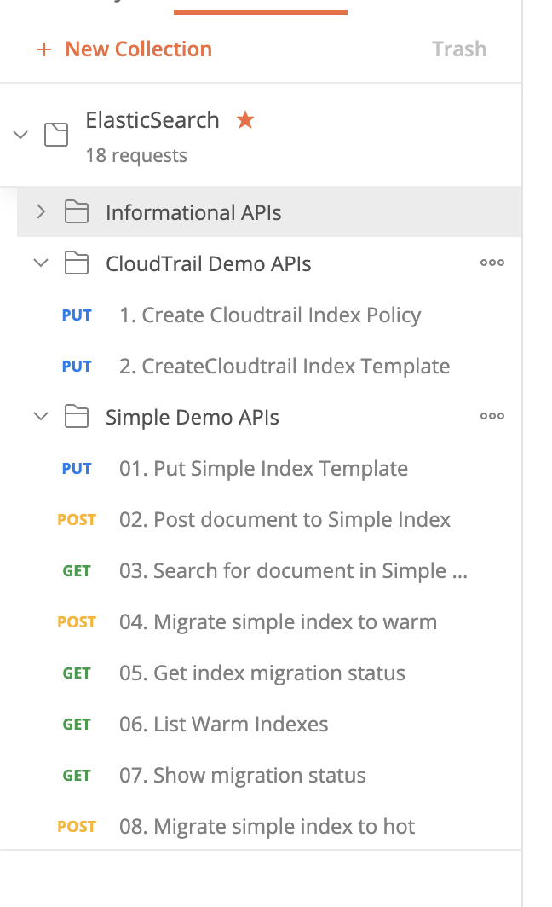

# Amazon Elasticsearch with UltraWarm - CDK Template

This is a CDK project to automate the creation of a basic Amazon Elasticsearch cluster with UltraWarm. This is for my own learning purposes. This is a test project and certain settings do not follow best practices for production usage. 

Read more about UltraWarm for Amazon Elasticsearch here:

* https://aws.amazon.com/blogs/database/retain-more-for-less-with-ultrawarm-for-amazon-elasticsearch-service/

## Architecture



This project deploys:

1. **VPC** a new VPC with a CIDR of 10.5.0.0/16 with two private and public subnets, one NAT Gateway, and an S3 VPC Endpoint.

1. **Elasticsearch cluster** - a new Elasticsearch cluster with three t3.medium master nodes, two m5.large data nodes, and two ultrawarm.medium nodes (See Note 1). The one data node has a 50 GB storage volume. 

1. **CloudTrail** - configures a new trail to send all regional and global management event logs to a CloudWatch Logs group

1. **CloudWatch Logs** - a log group that receives logs from CloudTrail and has an [subscription filter](https://docs.aws.amazon.com/AmazonCloudWatch/latest/logs/SubscriptionFilters.html) to send all logs to a Lambda function

1. **Lambda function** - receives CloudWatch Logs via a subscription filter and uses the Elasticsearch PUT/ API to write the logs to an index named `cloudtrail-YYYYMMDD`, where `YYYYMMDD` is the event timestamp per the logs. 

**Note 1** - Ultrawarm can only be used when a cluster has master nodes (3 = minimum) and at least two ultrawarm nodes; also, it does not support data nodes of the T2/T3 type (at this time). The lowest cost data node outside of the T2/T3 nodes is the m5.large.

## Cost

The majority of cost will come from the Elasticsearch cluster itself. For reference, cost in us-west-2 at time of writing is: 

```
  (three t3.medium.elasticsearch master nodes) * ($0.072 / hour) * (744 hours / mo) ~= $160 / mo
+ (two m5.large.elasticsearch data nodes)      * ($0.142 / hour) * (744 hours / mo  ~= $212 / mo
+ (two ultrawarm.medium nodes)                 * ($0.238 / hour) * (744 hours / mo) ~= $354 / mo
 ------------------------------------------------------------------------------------------------
                                                                                   ~= $726 / month ($23 / day)
 ```

Keep in mind, this estimate does not include the cost of CloudTrail, CloudWatch Logs, or the Lambda function... but they should be far lower. I've configured the CloudWatch log groups to only retain logs for one week to help keep log storage low. 

 ## Security

 The Elasticsearch cluster is deployed in a private subnet with a security group that allows all inbound traffic from the VPC CIDR (by default, `10.5.0.0/16`). In production, you might consider stricter security controls.

## Infrastructure Deployment

These instructions are my quick notes to myself. Their not in depth yet and assume you know your way around the AWS CDK.

1. Install and configure the AWS CLI and AWS CDK

1. Clone this project

1. From the project root, install Javascript dependencies for the CDK: `npm install`

1. **[Important]** Install Python dependencies for our Lambda function before deploying the project:

    1. Navigate to `~/lib/lambda/write-cloudtrail-to-es`
    1. Use pyenv and/or virtualenv to use Python version 3.8 (in my case, 3.8.6)
    1. Install Python dependencies: `pip install -r requirements.txt --target .`

1. Deploy the stack: `cdk deploy`

# Elasticsearch Demo APIs with Postman

The file `postman/postman_collection.json` is an importable collection of [Postman](https://www.postman.com/) queries that you can use to test your Elasticsearch cluster.

You don't need to use Postman, but it makes things easier. As an alternative, you could always execute the API commands directly from Kibana, an EC2 or Cloud9 instance, etc... but I'll assume you're using Postman.

## Postman Setup

1. Download and install [Postman](https://www.postman.com/)

1. Open Postman and click the **Import** button, then import the collection file at `postman/postman_collection.json`.

1. Configure the endpoint variable to point to your Elasticsearch domain:

    1. Click the elipses symbol near the collection name in Postman
    1. Click **Edit Collection**
    1. Click the **Variables** tab
    1. Set the initial and current value of the `endpoint` variable to your Elasticsearch endpoint. If you have direct access to your VPC (e.g. via a VPN connection), this will just be your cluster endpoint as shown in the Elasticsearch cluster. 
    
    **Or**, if you don't have a VPN connection, you could instead create an SSH tunnel from your local machine through a public EC2 in your VPC by following [these instructions](https://docs.aws.amazon.com/elasticsearch-service/latest/developerguide/es-vpc.html#kibana-test).

    **Or**, you could establish a VPN connection between your local machine and your VPC using [AWS Client VPN](https://docs.aws.amazon.com/vpn/latest/clientvpn-admin/what-is.html) (a managed OpenVPN service).

## Postman Queries

Once you've configured Postman and imported the collection of sample queries, your Postman view should look like this: 



### Informational APIs

The APIs here are just general, informational APIs that provide you information such as a list of the indexes, templates, shards, and related information.

### CloudTrail Demo APIs

This folder contains two example APIs that you should run sequentially. 

The API named `1. Create Cloudtrail Index Policy` creates an index policy `hot_to_warm_policy` that initially puts indexes in hot storage, moves them to warm storage after six hours, then deletes the index after 90 days.

The API named `2. CreateCloudtrail Index Template` creates a template that automatically applies the `hot_to_warm_policy` to any newly-created index whose name begins with `cloudtrail-*`. 

This CDK project deploys a Lambda that streams CloudTrail logs to indices with a naming convention of `cloudtrail-YYYYMMDD`, where `YYYYMMDD` is the date of the log event. This means that each day will have its index, which is a common pattern for log analysis in Elasticsearch.

### Simple Demo APIs

This is a collection of APIs that again should be run in order. 

High level, you will: 
1. First create an index template for any index whose name starts with `simple_index`; this template merely sets the index primary shard count to 1 and replica count to 0. 

2. Post a dummy document to an index named `simple_index` that has mock IoT sensor data, including the field `"sensorId": 40`. Note that since this is the first time we've posted to the simple_index, the index will automatically be created and our index template settings will be applied. Since we haven't specified otherwise, this new index will by default be created as a hot index. You can verify this by running the "List Hot Indices" API.

3. You should now run the sSearch for document" API before moving forward. Since your index is initially in hot storage, you should see a relatively low response time (e.g. ~40ms) in Postman. Run the API several times and notice that the response time stays relatively low. 

4. You then use the migrate API to move the index to warm storage. Since our index only has one item, this migration will happen very quickly. There is a sample query to view migration status, but its likely that the migration will complete before you even have a chance to run it.

5. After initiating the migration API, run the "List Warm Indices" API every few seconds until you see that the `simple_index` has moved to warm storage. 

6. Run the "Search for document" API again. The very first time you run it after the index is in warm storage, you should see a much higher retrieval time than before (e.g. a couple hundred ms). This is because the UltraWarm node must retrieve the document from Amazon S3.

7. Run the "Search for document" API once more. Now, you should see that the retrieval time is much lower, roughly the same performance as when the index was in hot storage. This is because your initial slower query pulled the data into UltraWarm and it is now cached by the UltraWarm node. Subsequent calls do not need to query S3 until the item expires from the cache. 

8. Additional APIs also allow you to migrate the index back to hot storage or delete the index to start from the beginning. 